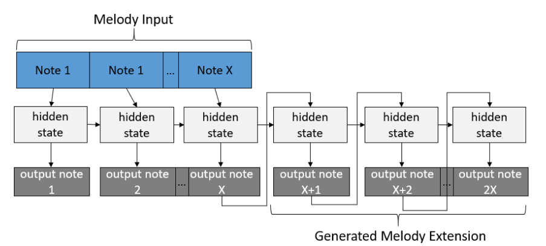

# Music-Generation-Using-Machine-Learning

## Purpose

Built a music generation application that can create an extension to a music segment inputted by the user. This software will allow users to quickly prototype different songs, without any knowledge of music theory. It will allow musicians to quickly prototype different songs, without needing any knowledge of music theory. All they need to do is create the initial melody and they can use the model to extend the music. The model was trained on 2000 initial/extension melody pairs. We also created a web user interface as well as added integration to an electronic keyboard so all users will have to do play a five-second melody on a keyboard and their input will be automatically fed through the model.

## Final Model Architecture

In this project, we iterated on three different types of models (CNN, RNN, and GANs) and before settling down on the final architecture which was a variation of the gated recurrent neural network. The model layout can be seen below:

During training, we had access to the true extensions but during testing, there was no melody extension for the model to learn from. The architecture needed to be changed as the model only has the input melody and therefore less information to work with. The input is passed through the model, returning a hidden state of the RNN representing that input. Notes are then individually generated and passed through the model and updating the hidden state, one at a time, until a sequence of notes corresponding to 5 seconds is generated. The final model is implemented in the final_model python notebook.

## Electronic Keyboard Integration

The second part of the project involved creating a user interface that enables an end to end system that prompts users to play a music segment for a 5-second duration on a connected MIDI keyboard and establishes a pipeline to process the input through the model and play the results back to the user. The user interface is displayed through the command line using Python. This interface counts down for a 3-second interval before prompting the user to play their melody on the keyboard. Subsequently, the MIDI events are read from the keyboard and displayed back on the terminal. MIDI input file and output file are at a consistent duration of 5 seconds ± 0.2 seconds and played back to the user. An output is generated in approximately 0.39 seconds and played back to the user fulfilling the immediate processing requirement of less than 1 second. Flask was used to integrate the model with the end to end system and the code  can be found in the app file

## Demo

A video presentation which includes a demo can be seen in the Presentation and Reports directory

## More Information

More information about this project can be seen in the Presentation and Reports directory

